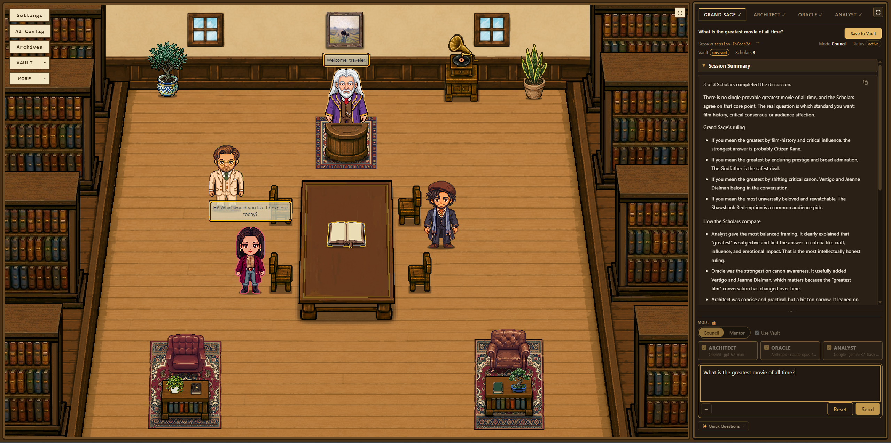

# Aether Library

[English](README.md) | 繁體中文

Aether Library 是一個多 AI 協作空間，讓你在同一個地方使用不同的 AI，從多個角度討論與回答問題。比較多位 AI 學者的觀點，由大智者統整出結論，並將討論結果保存在存放於自己裝置上的個人 Vault 中。

你的 API 金鑰、Vault 與討論紀錄都儲存在自己的裝置上。Aether Library 採用 local-first 設計，讓你保有對個人資料與知識庫的控制權。



## Aether Library 是什麼？

多數 AI 工具只會在聊天框裡給你單一模型的答案。Aether Library 的出發點是：困難的問題值得多種觀點，而有價值的對話值得被保存下來。

你可以打開閱覽室桌上的書本 Aetherom 來開始一場討論。選擇討論問題的模式：完整的智囊團（Council），由多位學者各自獨立作答；或是單獨一位導師（Mentor），提供聚焦的引導。並排比較各方回應，並將有意義的結論以純 Markdown 檔案存入你的 Vault。

圖書館本身並不只是裝飾。場景、角色與閱覽室，都是這個產品呈現其成果的一部分，而目前的
MVP 隨附 **Classic Library**。

## 功能

**智囊團模式（Council）** — 一個問題，多位學者（謀者 Architect、墨者 Oracle、理者
Analyst），各自以你指派給他們的供應商與模型獨立作答。接著大智者會檢視他們的答案，並依
問題所需的形式得出結論 — 可能是一項建議、一段說明，或是統整他們一致與分歧之處。

**導師模式（Mentor）** — 與單一位學者進行聚焦的對話，沒有大智者的步驟。

**多家供應商** — 可以將任何供應商與模型指派給任何一位學者或大智者，與該角色的身分無關。
目前支援：

| 供應商 | |
| --- | --- |
| OpenAI / GPT | |
| Anthropic / Claude | |
| Google / Gemini | |
| xAI / Grok | |
| Perplexity / Sonar | Sonar API |
| DeepSeek | |

**Vault** — 你自己的本機 Markdown 知識資料夾。已儲存的討論會寫成一般的 `.md` 檔案，你
可以用任何工具閱讀、搜尋、編輯或搬移。選用的整合功能也能把已儲存的討論匯出到現有的
Obsidian vault；內建的 Vault 仍然是主要系統，Obsidian 從來都不是必要的。

**檔案庫（Archives）** — 每一場完成的討論都會記錄在本機，讓你之後可以重新開啟。先前的
討論也可以作為新討論的起點延續下去，把稍早的對話當作脈絡帶入，而相關的討論會被歸在同一
個討論串中。

**附件** — 在提問前附加檔案、PDF、圖片或文字，讓學者能依據你自己的素材作答。你可以把
檔案拖放到輸入區，或直接從剪貼簿貼上圖片。

**引導教學** — 首次啟動時的 11 個步驟導覽，涵蓋設定、AI 配置、Vault、Aetherom、兩種
模式、附件，以及儲存你的成果。隨時都可以重新播放。

**兩種語言** — 介面提供英文與繁體中文，而大智者回覆時所使用的語言，與介面語言是分開
設定的。

## 開始使用

### 桌面應用程式 — 建議

1. 從[最新版本](https://github.com/aetherlibrary/aether-library/releases/latest)
   下載適合你平台的版本。
2. 執行它，然後像啟動其他應用程式一樣啟動 **Aether Library**。

| 平台 | 下載 |
| --- | --- |
| Windows 10/11（x64） | 安裝程式 |
| macOS Apple Silicon（arm64） | DMG |

不需要安裝其他任何東西 — 不需要 Node.js，也不需要終端機。

macOS 版本目前尚未經過程式碼簽章與公證（notarization），因此首次啟動時會被 macOS
阻擋。請在 Finder 中以右鍵 →「**打開**」開啟一次，之後就能正常啟動。

### 從原始碼執行

適用於 Linux、Intel Mac，或是你偏好直接執行程式碼的情況。

需要 **Node.js 20 或更新的版本**。沒有建置步驟。

```bash
npm install
npm start
```

然後開啟 **http://127.0.0.1:8477**。

`npm start` 會以正式模式執行應用程式 — 與桌面安裝程式所提供的是同一個應用程式，只是
改由你的瀏覽器開啟，而不是它自己的視窗。

## AI 配置

Aether Library 不隨附任何 API 金鑰，也不會預先啟用任何供應商。你想使用哪些供應商，就
自行提供對應的金鑰。

1. 啟動應用程式並點選 **進入圖書館**。
2. 開啟 **AI 配置**，至少加入一個供應商的金鑰。
3. 重新整理模型列表，並為每一位學者以及大智者選擇模型。
4. 你也可以點選 **連接 Vault**，選擇存放已儲存討論的資料夾。
5. 點選桌上的 **Aetherom**，開始你的第一場討論。

在這裡輸入的金鑰會寫入本機的 `.env.local` 檔案 — 桌面版是寫在你個人的應用程式資料
夾中，從原始碼執行時則寫在專案資料夾內。無論是哪一種，它都留在你的電腦上，除了你正在
呼叫的那個供應商以外，絕不會被送往任何地方。

## Vault 與隱私

Aether Library 是本機優先（local-first）的，而這代表什麼、又不代表什麼，值得說清楚。

**留在你的電腦上**

- 你的 API 金鑰，存放在本機的 `.env.local` 檔案中
- 你的 Vault — 位於你所選資料夾中的純 Markdown 檔案
- 你的檔案庫與應用程式設定
- 沒有帳號系統，也沒有任何 Aether Library 伺服器會經手你的討論

**會離開你的電腦**

- 你所提出的問題，連同任何附加的素材與相關脈絡，會被送往**你**所選擇的 AI 供應商 —
  而且僅限於這些供應商。該請求適用他們的條款與隱私權政策，用量也會顯示在你自己在他們
  那裡的帳號上。

Aether Library 不會估算一場討論花了多少錢。這部分請查看你的供應商後台。

## 開發

```bash
npm run dev     # development mode, with file watching
npm test        # node --test
```

`npm run dev` 會啟用應用程式內用來建立與調整場景的編寫工具。這些工具僅供開發使用，在
`npm start` 中是關閉的。

私有的開發儲存庫包含額外的編寫工具與內部設計素材，並不屬於這個公開發行版本的一部分。

進階：如果你偏好手動設定，而不是透過 **AI 配置** 來設定，`.env.example` 記錄了所有
可用的環境設定選項。

## 專案結構

```
src/            伺服器、服務、AI 供應商、語系
public/         應用程式介面 — 無建置步驟
electron/       包裝同一套伺服器與介面的桌面外殼
assets/         場景、角色、道具、美術與編寫的內容
config/         產品識別與應用程式外殼設定
test/           node:test 測試套件
docs/           技術文件
```

## 狀態

Aether Library 目前是 **v1.2.0**，已針對 Windows（x64）與 macOS Apple Silicon
（arm64）發行。核心流程 — 設定供應商、透過 Aetherom 以智囊團或導師模式提問、儲存到你
的 Vault、從檔案庫重新開啟 — 已經完成，並且處於日常使用中。

尚未提供：macOS 版本的程式碼簽章與公證、Intel Mac 版本、Classic Library 以外的其他
場景，以及更多語言。發行紀錄請見 [CHANGELOG.md](CHANGELOG.md)，未來的規劃請見
[ROADMAP.md](ROADMAP.md)。

## 連結

- **下載** — https://github.com/aetherlibrary/aether-library/releases/latest
- **GitHub** — https://github.com/aetherlibrary/aether-library
- **官方網站** — https://aetherlibrary.app
- **Discord** — https://discord.gg/Gc9BR5wmt
- **意見回饋與問題回報** — https://forms.gle/iGkDLfqnhZqMyUag6
- **支持開發** — https://ko-fi.com/kazchang

## 授權

Copyright © 2026 Kaz Chang. All rights reserved.

原始碼公開可見，目的是為了透明與供人檢視。**本軟體並非開源軟體。** 若要複製、修改、
再散布，或以商業方式再利用其原始碼、美術或素材，均須事先取得著作權人的書面許可。

完整條款請見 [LICENSE](LICENSE)。
